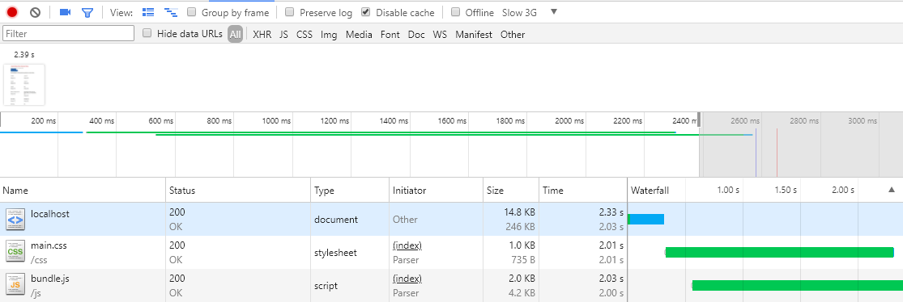
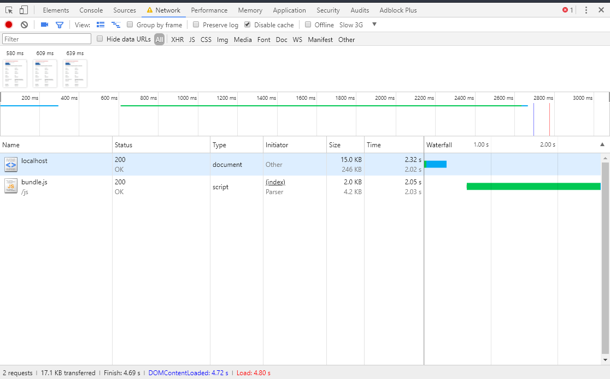
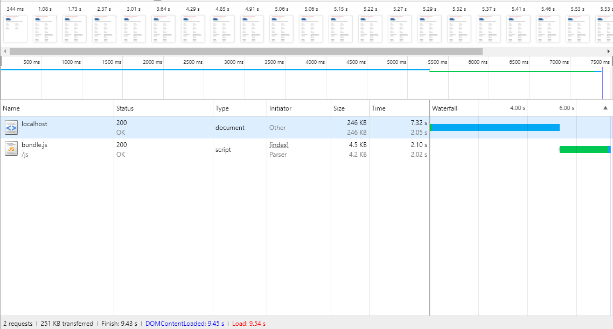
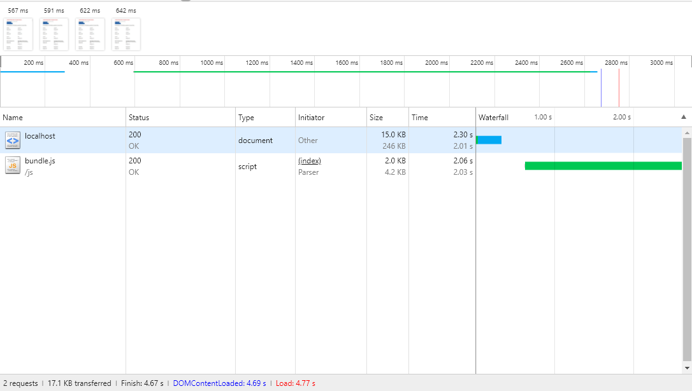
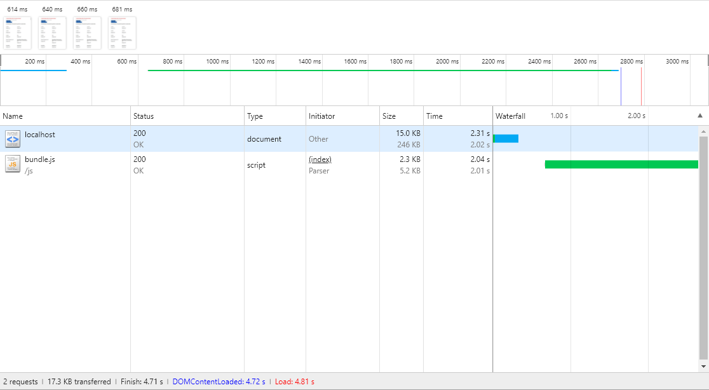

# performance-matters-server-side

## Requirements
`npm` version tested: `v5.7.1`  
`node` version tested: `v8.9.4`  
[node-gyp](https://github.com/nodejs/node-gyp) version tested: `v3.6.2`

## How to setup
1. `` npm -v && node -v && node-gyp -v `` to ensure you have the requirements
1. `` npm install `` 
  * If you experience the fsevents bug, try `` npm install -no-optional ``
1. `` npm start `` 

## Tooling
As tooling i've used `browserify`, `js-uglify` && `nodemon`  
Browserify to bundle the client-side javascript  
js-uglify to compress this bundle  
Nodemon as a change watcher  
'npm' to orchestrate the script calling, making it possible to run them with 1 command.

## Performance
### Setup
For the testing i've used Chrome and it's developer tools, especially the audit tool.  
In this i disabled the cache, throtled on Slow 3G
### Results
#### Critical CSS
Firstly I converted my css to critical css. Since the css is fairly small & everything is needed, i went ahead and added all css to [main.html](templates/main.html). However, I would love to look into [automating](https://github.com/addyosmani/critical) this step, together with [css minifying](https://www.npmjs.com/package/css-minify)   

First meaningful paint : **2.39s**
Time blocked by the css : **2.01s**

First meaningful paint: **540ms**

As we can clearly see, critical css has a big impact. It almost took the loading time down by 2 seconds (1.850s). This is definilty something i can recommend automating

#### Compression
For compression (gzip) i used [compression](https://github.com/expressjs/compression/blob/master/README.md) a express/node.js middleware which automatically gzips all text files. 

First meaningful paint: *1.08s*
Complete load: *9.54s*

First meaningful paint: *567ms*
Complete load: *4.77s*

This one is really drastic, it halves our loading time! Considering how short (5min) this takes to setup, this is heavily recommended to do.

#### JS minification
As mentioned above i've included `uglify-js` to  minify my javascript automatically.

First meaningful paint: *614ms*
Complete load: *4.81s*

First meaningful paint: *561ms*
Complete load: *4.76s*

Quite a nice improvement of 50ms, especially considering how easy it is to configure.

### Future/todo list
* I really want to get server side loading of geo location maps working. I have the script to generate the images but WKT to GEOJSON parsing proved to be quite difficult
* Put some more care into the overall design (css/html) since i'm not satisfied with this yet.
